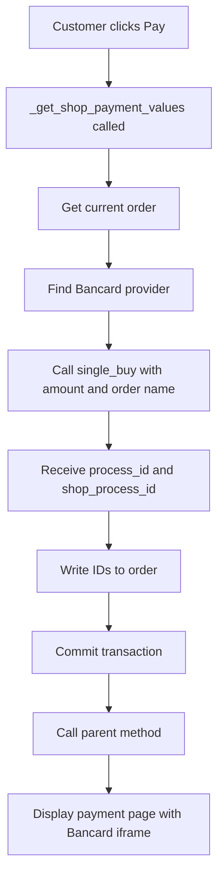

## Overview

The `WebsiteSaleSingleBuyCustom` controller extends Odoo's `WebsiteSale` controller to integrate Bancard Single Buy payment processing. It intercepts the payment flow to generate Bancard process IDs before displaying payment options.

## _get_shop_payment_values

Overrides the parent method to inject Bancard payment initialization logic.

### Method Signature

```python
class WebsiteSaleSingleBuyCustom(WebsiteSale):
    def _get_shop_payment_values(self, order, **kwargs):
```

<ParamField path="order" type="sale.order">
  The sale order object for which payment is being processed
</ParamField>

<ParamField path="kwargs" type="dict">
  Additional keyword arguments passed from parent method
</ParamField>

### Return Value

Returns the result from the parent class's `_get_shop_payment_values()` method, containing:
- Available payment providers
- Order details
- Payment form values
- Bancard process_id and shop_process_id (added to order)

### Workflow

1. **Retrieve Current Order**
   ```python
   order = request.website.sale_get_order()
   ```

2. **Find Bancard Provider**
   ```python
   single = request.env["payment.provider"].sudo().search(
       [("code", "=", "bancard")], limit=1
   )
   ```

3. **Generate Process IDs**
   ```python
   process_id, shop_process_id = single.single_buy(
       order.amount_total, 
       order.name
   )
   ```

4. **Update Sale Order**
   ```python
   order.write({
       "process_id": process_id,
       "shop_process_id": shop_process_id,
   })
   ```

5. **Commit Transaction**
   ```python
   request.env.cr.commit()
   ```

6. **Call Parent Method**
   ```python
   response = super()._get_shop_payment_values(order, **kwargs)
   return response
   ```

### Process ID Generation

The `single_buy()` method (from the payment provider model) returns two values:

<ParamField path="process_id" type="string">
  Unique identifier used to generate the Bancard payment iframe
</ParamField>

<ParamField path="shop_process_id" type="integer">
  Shop-specific process identifier used to track the transaction in webhooks
</ParamField>

### Integration with Sale Order

The method updates the sale order with Bancard-specific fields:

```python
class SaleOrder(models.Model):
    _inherit = "sale.order"
    
    process_id = fields.Char(
        string="Guardamos el id para generar el iframe de bancard",
        store=True
    )
    shop_process_id = fields.Integer(
        string="Guardamos el id del shop de la venta",
        store=True
    )
```

### Example Usage

```python
# When customer reaches /shop/payment page:
# 1. Order is retrieved: SO0123 with amount_total = 150000
# 2. Bancard provider is found
# 3. single_buy(150000, "SO0123") is called
# 4. Returns: process_id="abc123xyz", shop_process_id=789456
# 5. Order is updated with these IDs
# 6. Payment page displays with Bancard iframe using process_id
```

### Order Processing Flow



### Error Handling

The method assumes:
- An active order exists in the session
- Bancard payment provider is configured with code="bancard"
- The `single_buy()` method successfully returns both IDs

If no order exists, the method skips Bancard initialization and proceeds with standard payment flow.

### Logging

```python
_logger.info(f"ANTES, ORDEN: {order.id} - {order.name} ")
_logger.info(
    f"PROCESS_ID DE BANCARD: {order.process_id} - {order.shop_process_id}"
)
```

Logs are written at INFO level for debugging payment flow issues.